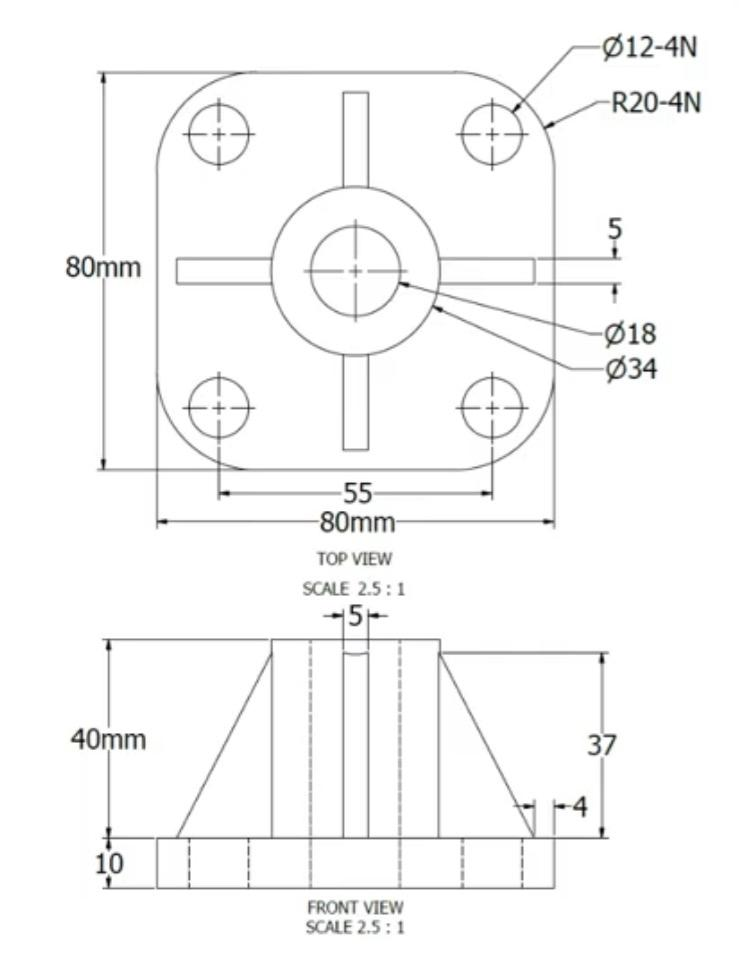
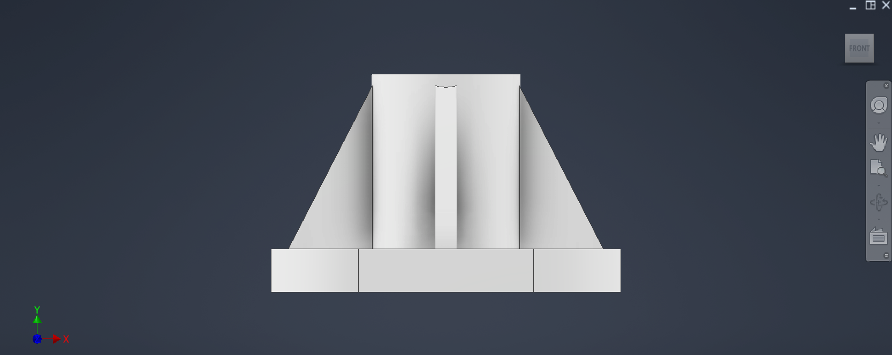
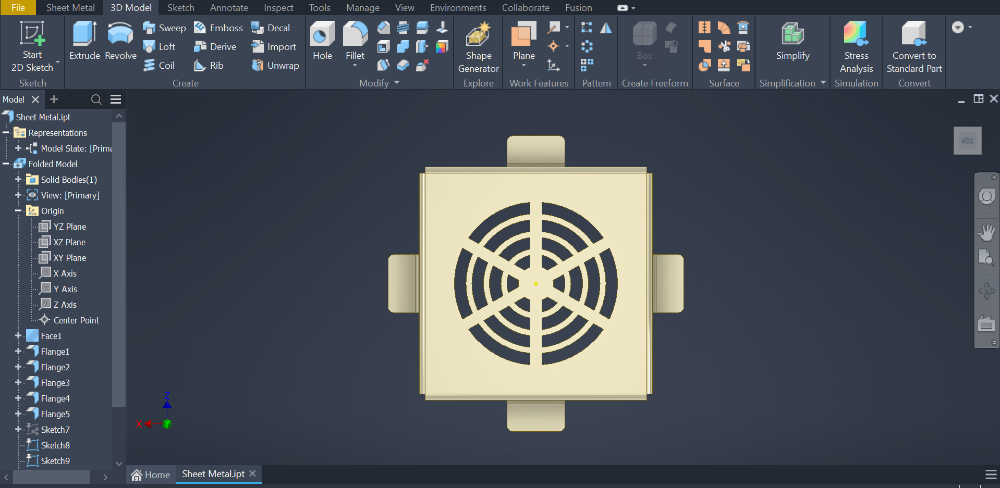
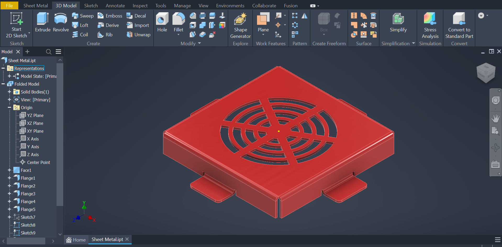
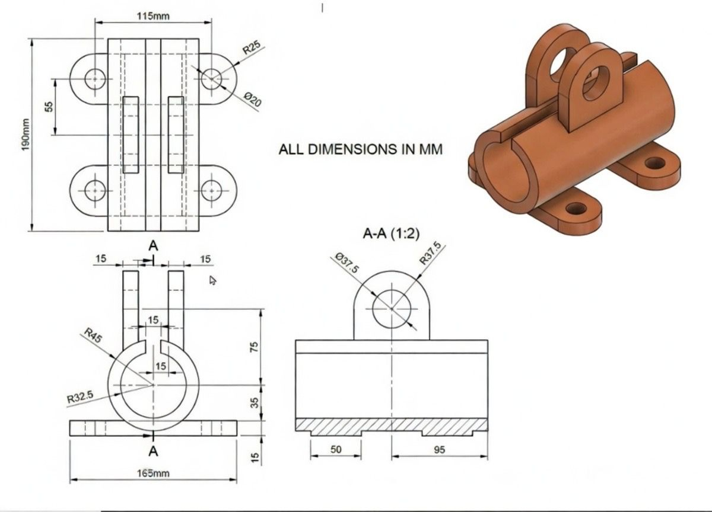
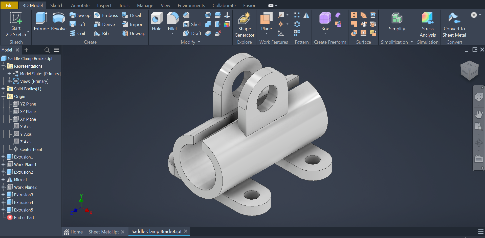

# 🚀 AUTODESK INVENTOR

# Flanged Conical Support Pedestal

## 📖 Overview
This project models a flanged conical support pedestal with square base and central cylindrical protrusion, fully created in Autodesk Inventor. The component demonstrates key Inventor workflows: sketch-based extrusion, revolve for cylindrical and conical features, patterned holes, large fillet transitions, and precise dimension-driven modeling from an engineering drawing.

## 🎯 Objective
Accurately recreate the support pedestal from the provided technical drawing while ensuring clean, parametric, manufacture-ready geometry suitable for machining, casting or 3D printing. Commonly used as an elevated base for pipes, shafts, rods or machinery components.

## ⚙️ Specifications & Commands

| **Design Specifications**          | **Autodesk Inventor Commands / Features Demonstrated** |
|------------------------------------|--------------------------------------------------------|
| Base: 80 × 80 mm                   | Sketch → Extrude                                       |
| Mounting holes: 4 × Ø12 mm         | Hole → Circular Pattern                                |
| Central boss Ø: 34 mm outer / 18 mm inner | Revolve                                         |
| Overall height: 40 mm              | Extrude / Revolve                                      |
| Base thickness: 10 mm              | Extrude                                                |
| Taper height: 37 mm                | Fillet (R20 mm)                                        |
| Large fillet: R20 mm               | Fillet tool                                            |
| Units: Millimeters (mm)            | Parametric dimensions & constraints                    |

## ✨ Design Features
- Square base with four corner mounting holes  
- Conical tapered transition body  
- Central cylindrical boss with through bore  
- Large R20 mm rounded base transitions  
- Uniform geometry suitable for casting/machining  

## 📐 Technical Drawing Source
Model built directly from the provided 2D drawing:  
- Top view: 80 mm square, Ø34/Ø18 mm central features, four Ø12 mm holes  
- Front view: 40 mm height, 10 mm base, 37 mm taper, 5 mm top step  
- All dimensions and fillet callouts in mm  

## 📸 Models / Screenshots

  
  
  

## 📥 CAD Downloads

[Download archive](./Flanged%20Support.zip)  

## 🏭Manufacturing Considerations

Recommended methods:
- CNC machining (aluminum/steel)  
- Sand/investment casting + finish machining  
- 3D printing (prototypes)  

Supports:  
- M10–M12 bolts through Ø12 mm holes  
- Large R20 fillets for stress relief & deburring  

## 🌐 Applications
- Pipe/tube support stands  
- Shaft/rod pedestals  
- Machinery alignment bases  
- Equipment mounting supports  

## 💭 Reflection
This Inventor project demonstrated:

- Interpreting multiview drawings  
- Revolve & extrusion for cylindrical/conical geometry  
- Fully constrained parametric sketches  
- Large fillets for production-ready parts  
- Clean model for drawings/assemblies/CAM  

Possible enhancements:  
- Add bolt features  
- Create annotated drawing sheet  
- Assign material & mass  
- Basic stress simulation  
- Small assembly with sample component  

Feedback welcome! 💬

# Sheet Metal Concentric Ventilation Cover

## 📖 Overview
This project models a square sheet metal cover featuring a radial concentric ventilation / louver pattern and four folded side flanges. Built entirely in **Autodesk Inventor Sheet Metal**, it demonstrates core workflows: base face creation, multi-side flanging, circular patterning for cutouts, bend management, and clean folded/flat states, ideal for enclosure panels, fan guards, or breather covers.

## 🎯 Objective
Create a parametric, production-ready sheet metal part with precise bends and a visually appealing functional ventilation pattern, suitable for laser cutting + bending or CNC punching.

## ⚙️ Specifications & Commands

| **Design Specifications**              | **Autodesk Inventor Commands / Features Demonstrated** |
|----------------------------------------|--------------------------------------------------------|
| Square central panel                   | Sheet Metal Defaults → Face                            |
| Four equal side flanges                | Flange (applied to four edges)                         |
| Concentric circular ventilation slots  | 2D Sketch → Circular Pattern → Cut                     |
| Uniform bend radius & relief           | Automatic / rule-based bend allowance                  |
| Folded model with clean appearance     | Folded Model + Flat Pattern view                       |
| Units: Millimeters (mm)                | Parametric dimensions & constraints                    |

## ✨ Design Features
- Square base with radial/concentric slot pattern for airflow  
- Four symmetric mounting flanges (ready for hole addition)  
- Smooth, consistent bends suitable for press brake  
- Fully unfoldable flat pattern for DXF export / fabrication  
- Organized feature tree with multiple sketches for pattern control  

## 📐 Modeling Approach
1. Set up **Sheet Metal Defaults** (thickness, bend radius, etc.)  
2. Created base **Face** from square sketch  
3. Added **Flange** features on all four sides  
4. Sketched concentric circles/arcs on face (or in flat state)  
5. Applied **Circular Pattern** to create repeating slots  
6. Used **Cut** to remove material for ventilation  
7. Verified flat pattern and bend lines  

## 📸 Models / Screenshots

  
  
  

## 📥 CAD Download

[Download complete Inventor project (part file + sheets)](./Sheet%20Metal.zip)

## 🏭 Manufacturing Considerations

Recommended methods:
- Laser cut or turret punch flat pattern → CNC press brake bending  
- Material: steel (0.8–2 mm), stainless, or aluminium  
- Finish: powder coat, zinc plate, or passivation  

Mounting: flanges designed for screws/bolts (add holes in production variant)  
Ventilation: provides good airflow + finger/object protection  

## 🌐 Applications
- Fan / blower guards  
- Electrical cabinet vents  
- Equipment enclosure breathers  
- Audio speaker grilles  
- Protective panels for machinery  

## 💭 Reflection
This project highlighted:
- Clean **Face + Flange** workflow for boxed sheet metal parts  
- Effective use of **Circular Pattern** in sheet metal context  
- Managing folded vs. flat representations  
- Parametric control for easy design updates  
- Production-oriented modeling (bend-aware geometry)  

Possible enhancements:  
- Add mounting holes to flanges  
- Generate flat pattern drawing with bend notes  
- Assign material → calculate mass / cost estimate  
- Export flat DXF for direct fabrication  
- Add ribs or hems for added stiffness  

Feel free to use, modify or reference for similar sheet metal enclosure / guard designs!

# Heavy-Duty Saddle Clamp Bracket

## 📖 Overview
This project models a **heavy-duty saddle clamp bracket** designed to securely hold pipes, tubes, rods or shafts. It features a wide rectangular base with four mounting holes, a central semi-cylindrical saddle cradle, and two upward-extending retaining lugs/ears with Ø20 mm holes for secondary fastening or alignment. Fully built in **Autodesk Inventor** from the provided engineering drawing, the model uses extrude, fillet, mirror, hole patterning and precise radius control to create a strong, production-ready part suitable for casting, CNC machining or fabrication.

## 🎯 Objective
Faithfully reproduce the saddle clamp bracket from the multi-view technical drawing, capturing all specified dimensions, fillet radii, wall thicknesses and proportions, ensuring the geometry is parametric, symmetric and optimized for real-world manufacturing and load-bearing applications.

## ⚙️ Specifications & Commands

| **Design Specifications**                  | **Autodesk Inventor Commands / Features Demonstrated** |
|--------------------------------------------|--------------------------------------------------------|
| Base: 165 × 50 mm (overall footprint 165 × 95 mm) | Sketch → Extrude                                       |
| Base mounting holes: 4 × Ø20 mm            | Hole → Rectangular Pattern / Mirror                    |
| Lug holes: 2 × Ø20 mm (115 mm centers)     | Hole tool                                              |
| Saddle cradle: Ø75 mm nominal diameter     | Revolve / Sweep / Extrude + Fillet                     |
| Lug / wall thickness: 15 mm                | Extrude + Mirror                                       |
| Key fillets: R45 mm, R32.5 mm, R37.5 mm    | Variable / constant Fillet tool                        |
| Overall height: 190 mm                     | Multi-feature modeling                                 |
| Cradle inner radius: R37.5 mm              | Fillet / Revolve                                       |
| Side offsets / steps: 15 mm                | Extrude cut                                            |
| Units: Millimeters (mm)                    | Fully constrained parametric sketches                  |

## ✨ Design Features
- Wide, stable rectangular base with four Ø20 mm mounting holes  
- Deep semi-circular saddle (Ø75 mm) to cradle pipes/rods securely  
- Two tall symmetric lugs spaced 115 mm apart with Ø20 mm through holes  
- Generous fillet transitions (R45 mm base-to-saddle, R32.5 mm saddle-to-lug, R37.5 mm inner cradle)  
- Uniform 15 mm thick sections for high strength  
- Smooth, cast-friendly geometry with large radii to reduce stress concentrations  

## 📐 Technical Drawing Source
Model created directly from the supplied multi-view drawing:  
- Top view: 115 mm lug spacing, Ø20 mm holes, 55 mm inner width  
- Front view: 190 mm total height, 165 mm base width, major fillet callouts  
- Section A-A (1:2 scale): Ø75 mm cradle, R37.5 mm inner radius, 15 mm wall steps, R45 / R32.5 fillets  
- Isometric reference view included  

## 📸 Models / Screenshots

  
  
  
  
  

## 📥 CAD Download

[Download complete Inventor project (part file + any sheets)](./Saddle%20Clamp%20Bracket.zip)

## 🏭 Manufacturing Considerations

Recommended methods:
- Sand / investment casting (ductile iron, cast steel) + machining of critical faces/holes  
- CNC milling from solid bar or plate (steel, stainless, aluminum prototypes)  
- Welded fabrication (base plate + rolled tube + welded lugs) for low-volume  

Key notes:
- Large fillets improve castability, reduce stress risers and ease deburring  
- Ø20 mm holes accept M16–M20 bolts / pins  
- Generous radii suitable for core pull and mold release  

## 🌐 Applications
- Pipe / tube saddle supports on machinery frames  
- Hydraulic line clamping brackets  
- Shaft or axle holders in equipment  
- Structural rod / bar restraints  
- Heavy vehicle or trailer frame attachments  

## 💭 Reflection
This Inventor project demonstrated:

- Precise translation of complex multiview + sectioned drawings into 3D  
- Effective use of **Fillet** (multiple radii), **Mirror**, **Extrude** and **Hole** tools  
- Building symmetric, load-bearing geometry with production in mind  
- Maintaining full parametric control for future modifications  
- Clean feature tree and dimension-driven design  

Possible enhancements:  
- Add 1–2° draft angles for casting  
- Generate fully annotated 2D drawing (.idw) with GD&T  
- Assign material → compute mass, volume, CoG  
- Perform FEA stress analysis under typical pipe load  
- Create assembly with sample pipe segment and fasteners  
- Parameterize for different pipe diameters (family table / iPart)  

Feel free to fork, adapt or reference for similar saddle clamp or pipe support designs!

# Clevis Bracket 

## 📖 Overview
This project models a clevis bracket (forked / yoke bracket) fully created in Autodesk Inventor. The component was built directly from the provided engineering drawing and demonstrates key Inventor workflows: multi-depth extrusions, complex profile sketching with arcs and angles, multiple fillet radii, hole placement, and precise dimension-driven parametric modeling.

## 🎯 Objective
Accurately recreate the clevis bracket geometry exactly as shown in the technical drawing while maintaining fully constrained, parametric sketches and clean transitions suitable for manufacturing (CNC machining, casting or prototyping).

## ⚙️ Specifications & Commands

| Design Specifications                  | Autodesk Inventor Commands / Features Demonstrated    |
|----------------------------------------|--------------------------------------------------------|
| Overall span ≈ 90 mm + 40 mm           | Sketch → Extrude (multiple depths)                     |
| Three Ø12 mm holes (3 Nos)             | Hole / Circle → Rectangular or 3-point placement       |
| Large outer radii: R40, R30, R28, R15  | Fillet (multiple different radii)                      |
| Main circular feature Ø78 mm           | Sketch arcs + Fillet / Extrude                         |
| Smaller circular features Ø30, Ø20     | Cut / Pocket extrusion                                 |
| Angles: 12° and 45°                    | Angular dimensions & constraints in sketch             |
| Thickness steps: 6, 10, 12, 18, 20 mm  | Multi-body or multi-depth extrusion + offset           |
| Stepped heights: 30 mm, 65 mm sections | Extrude + new sketch planes / faces                    |
| Units: Millimeters (mm)                | Document units + parametric dimensions                 |

## ✨ Design Features
- Forked / clevis end with three aligned Ø12 mm through holes  
- Large external corner radii (R40 – R15) for strength and smooth appearance  
- Central reinforced circular area Ø78 mm  
- Stepped / variable thickness body (6–20 mm)  
- Angled webs or supports at 12° and 45°  
- Blended transitions and multiple fillet sizes throughout  

## 📐 Technical Drawing Source
Model built 100% from the provided 2D drawing (**CB0.jpeg**):  

- Main view showing:  
  - Ø78, Ø30, Ø20, R40, R30, R28, R15, three Ø12 holes  
  - 12° and 45° angles  
  - 90 mm and 40 mm reference lengths  

- Orthographic / sectional view showing:  
  - Heights/steps: 30 mm, 65 mm, 20 mm  
  - Thicknesses: 6 mm, 10 mm, 12 mm, 18 mm  
  - All other linear dimensions  

## 📸 Models / Screenshots

## 📥 CAD Downloads

[Download complete Inventor part file](./Clevis%20Bracket.zip)

## 🏭 Manufacturing Considerations

Recommended methods:
- 3-axis or 5-axis **CNC milling** from steel / stainless / aluminum plate  
- **Investment casting** or sand casting + finish machining  
- **3D printing** (metal or high-strength polymer) for prototypes  

Design supports:
- Ø12 mm standard clevis pin or bolt  
- Large corner radii reduce stress concentrations and improve castability  
- Smooth fillets facilitate deburring and surface finishing  

## 💭 Reflection
This Inventor project demonstrated:

- Reading and accurately transferring complex multiview drawings with mixed angles and multiple radii  
- Building robust parametric sketches with tangent & angular constraints  
- Using variable-depth extrusions and multiple fillet operations efficiently  
- Creating production-intent geometry with generous transitions  

Possible next steps:
- Create 2D annotated drawing (.idw) with tolerances  
- Add material assignment and mass properties  
- Model mating clevis pin or rod for small assembly  
- Export neutral formats (STEP / IGES) for CAM or sharing  

Feedback welcome! 💬

